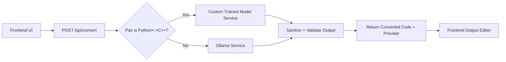

# AI Code Translator

Translate code between C, C++, Java, Python, and JavaScript with a hybrid backend:

- Python <-> C++ uses a custom fine-tuned local model path.
- All other language pairs are powered by Ollama.

---

## Visual Preview


- Demo GIF link: `TBD`
- Live demo link: `TBD`

---

## How This Project Works

### Core Routing Logic

- Python -> C++ and C++ -> Python:
	- Routed to the custom trained model service in `backend/services/trainedModelService.py`.
	- Uses persistent worker mode with model-only fallback retry.
- All other pairs (C, C++, Java, Python, JavaScript except Python<->C++):
	- Routed to Ollama in `backend/services/ollamaService.js`.

### Conversion Flow



---

## Project Structure (Analyzed)

```text
ai-code-translator/
	backend/                Node API + routing + model services
		routes/               API routes
		services/             Ollama and trained-model conversion logic
		requirements.txt      Python dependencies for model service
		server.js             Express server entry

	frontend/               Main React + Vite app
		src/components/       Editor and language selector components
		src/hooks/            API integration hook

	perf-checker/           Optional performance testing UI
	Model/                  Local model artifacts (config/tokenizer/weights)
	render.yaml             Render backend deployment blueprint
	vercel.json             Vercel frontend deployment config
```

---

## Pretrained Model Summary (Python <-> C++)


### 1) Data Preparation

- Loaded two JSON datasets:
	- `dataset_50k_cpp_to_py.json`
	- `dataset_50k_py_to_cpp.json`
- Renamed columns for consistency:
	- `input` -> `source_code`
	- `output` -> `target_code`
- Added direction tags:
	- `cpp_to_py`
	- `py_to_cpp`
- Combined to 100,000 total records.
- Formatted model input text as:
	- `Translate {source_lang} to {target_lang}: {source_code}`

### 2) Model Setup

- Base model: `t5-small`
- Tokenizer: matching T5 tokenizer from `transformers`
- Train/Test split:
	- 90,000 train
	- 10,000 test

### 3) Dataset + Collation

- Implemented custom `CodeTranslationDataset` (`torch.utils.data.Dataset`).
- Tokenized both input and target with max lengths:
	- input: 512
	- target: 512
- Used `DataCollatorForSeq2Seq` for dynamic padding.

### 4) Training

- Used `Trainer` API with:
	- epochs: 3
	- batch size: 8
	- warmup steps and weight decay
	- standard logging and checkpoints

### 5) Evaluation

Reported metrics:

- `eval_loss`: 7.522711342744515e-08
- `eval_runtime`: 58.4231 sec
- `eval_samples_per_second`: 171.165
- `eval_steps_per_second`: 21.396
- `epoch`: 3.0

### 6) Save + Inference

- Saved fine-tuned artifacts to `./fine_tuned_t5_model`.
- Reloaded model/tokenizer and tested sample translations.

### Dataset Links (Add Later)

- C++ -> Python dataset: `TBD`
- Python -> C++ dataset: `TBD`
- Training notebook/script link: `TBD`

---

## Localhost Setup and Run

Use Windows PowerShell from project root.

### 1) Install dependencies

```powershell
cd D:\AI\ai-code-translator
npm --prefix backend install
npm --prefix frontend install
npm --prefix perf-checker install
```

### 2) Start services (recommended: separate terminals)

Terminal A (backend):

```powershell
cd D:\AI\ai-code-translator
npm --prefix backend run dev
```

Terminal B (frontend):

```powershell
cd D:\AI\ai-code-translator
npm --prefix frontend run dev -- --port 6002
```

Terminal C (optional perf checker):

```powershell
cd D:\AI\ai-code-translator
npm --prefix perf-checker run dev
```

### 3) Start Ollama locally

```powershell
ollama serve
```

---

## Default Local URLs

- Frontend: `http://localhost:6002`
- Backend health: `http://localhost:6001/health`
- Backend perf: `http://localhost:6001/health/perf`
- Perf checker: `http://localhost:6003`

---

## Environment Variables

Copy `backend/.env.example` to `backend/.env` and configure as needed.

Important keys:

- `PORT`: backend port (default `6001`)
- `CORS_ORIGINS`: allowed frontend origins
- `OLLAMA_BASE_URL`: local or remote Ollama endpoint
- `OLLAMA_MODEL`: model name (for example `codellama:latest`)
- `TRAINED_MODEL_PERSISTENT`: keep Python<->C++ model worker hot
- `TRAINED_MODEL_WORKER_IDLE_MS`: worker idle timeout
- `TRAINED_MODEL_PATH`: path to local model artifacts
- `PYTHON_EXECUTABLE`: Python binary path

---

## Features

- Hybrid model routing (custom model + Ollama)
- Source-language auto-detection support
- Structured output sanitization for mixed-language artifacts
- Request timeout handling and robust error responses
- `/api/convert` rate limiting and request-size limits
- Basic performance metrics endpoint
- Frontend code editor, language swap, copy result, and error banner

---

## Deploy Overview

### Backend (Render)

- Uses `render.yaml`
- Root directory: `backend`
- Start command: `npm run start`

### Frontend (Vercel)

- Uses root `vercel.json`
- Builds from `frontend`
- Set `VITE_API_BASE_URL` to Render backend URL

---

## Common Troubleshooting

### 1) "Ollama is not available" or fetch errors

- Ensure Ollama is running and reachable from backend.
- Verify `OLLAMA_BASE_URL` and `OLLAMA_MODEL`.

### 2) Slow first request on cloud

- Worker/model warm-up and network latency are expected on Render.
- Increase worker idle timeout to reduce repeated warm starts.

### 3) Port conflicts locally

- Stop old processes on 6001/6002/6003 and restart.

---

## Scripts Quick Reference

Root:

- `npm run dev:all`
- `npm run start:all`

Backend:

- `npm --prefix backend run dev`
- `npm --prefix backend run start`

Frontend:

- `npm --prefix frontend run dev -- --port 6002`

Perf checker:

- `npm --prefix perf-checker run dev`
